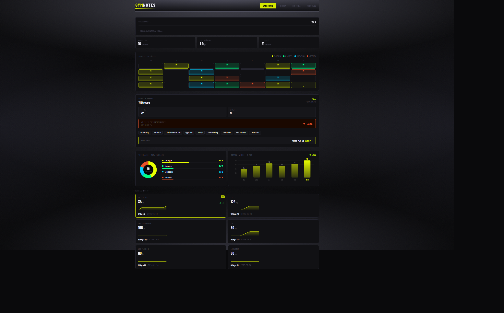
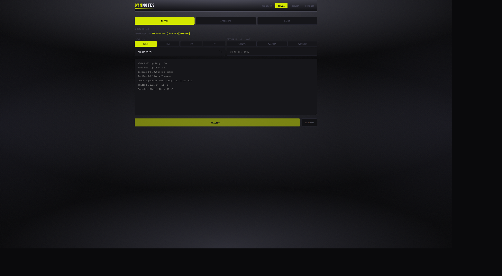
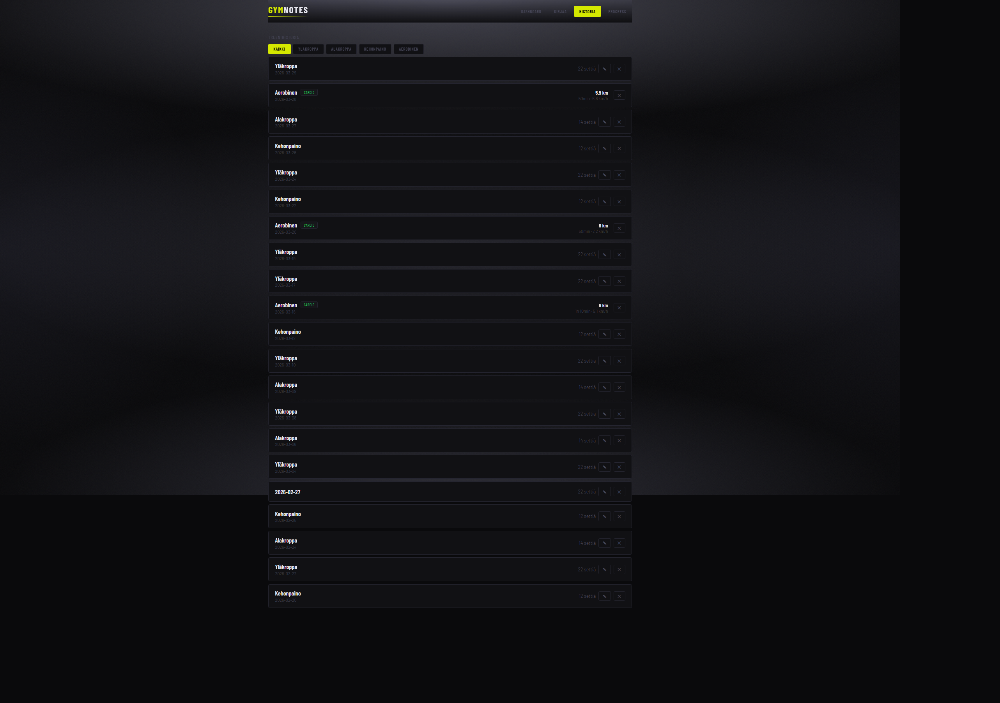
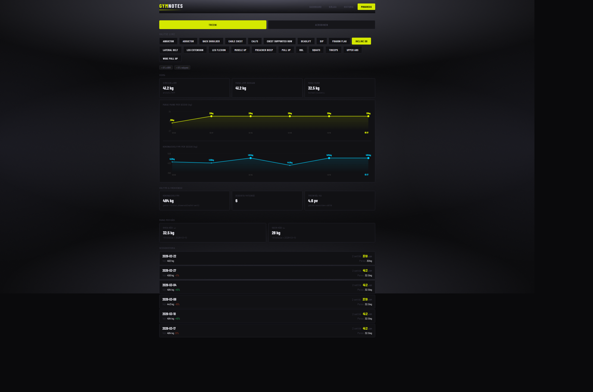
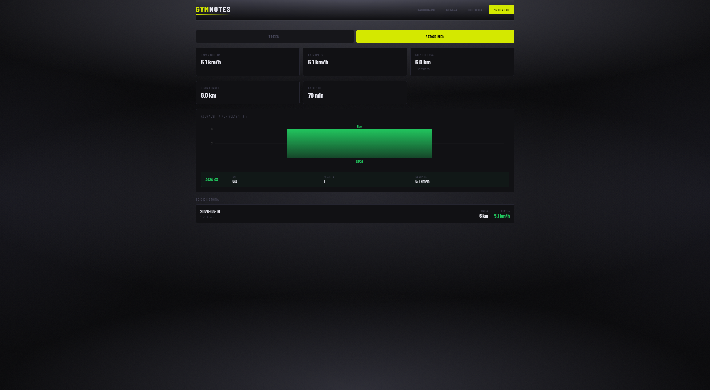
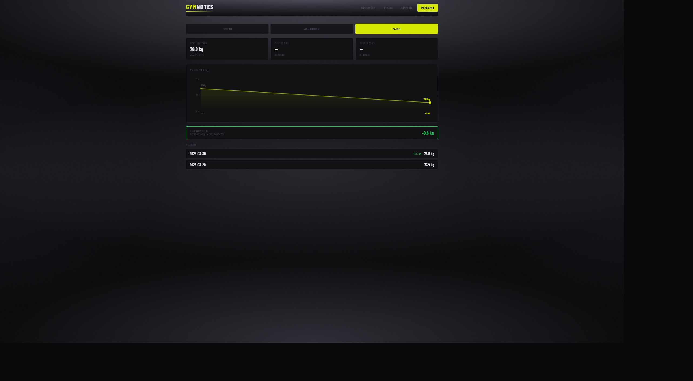

# GymNotes

Personal gym tracking and analytics application for logging workouts and visualizing training progress over time.

Built by Honar Abdi

---



---

## What is this?

I have been going to the gym regularly for over a year and wanted a proper way to track my progress. Instead of spreadsheets or generic fitness apps, I built exactly what I needed. A personal analytics tool that turns raw workout data into meaningful insights.

---

## Screenshots

| Dashboard | Workout Logging |
|-----------|----------------|
|  |  |

| History | Progress |
|---------|----------|
|  |  |

| Cardio Progress | Weight Tracking |
|----------------|----------------|
|  |  |

---

## Features

### Dashboard
- Weekly training goal with progress bar
- 28-day calendar with color-coded session types (upper body, lower body, bodyweight, cardio)
- Last session summary with volume comparison against previous same session type
- Training split breakdown for the current month
- Weekly set volume chart for the last 6 weeks
- Personal records per exercise with sparkline trend charts sorted by progression

### Workout Logging
- Natural language bulk input, one set per line
- Format: `Exercise weight x reps [+extrareps] [rir N] [right/left]`
- Bodyweight exercises supported: `Exercise x reps`
- Quick-select buttons for session type and date
- Dynamic examples per session type
- Preview and confirm before saving

### Cardio
- Log aerobic sessions with duration and distance
- Auto-calculated speed in km/h with live preview

### History
- Full session history sorted by date
- Filter by session type: upper body, lower body, bodyweight, cardio
- Expandable session details
- Edit session name or add sets to existing sessions
- Delete entire sessions

### Progress
- Per-exercise analytics with best weight and volume trend charts
- 3-session moving average for strength and volume trends
- Bodyweight exercise tracking by rep count and added weight
- Volume and frequency statistics
- RIR intensity tracking
- Left/right side tracking for unilateral exercises
- Plateau detection
- Cardio analytics with speed trend chart and monthly volume
- Body weight tracking with trend chart and weekly and monthly change

---

## Tech Stack

| Layer | Technology |
|-------|-----------|
| Backend | Python, FastAPI, SQLite, Pydantic |
| Frontend | React, Vite |
| Charts | Canvas API, no chart library |
| Styling | CSS Variables, custom animations |

---

## Project Structure
```
gym-agent/
├── app/
│   ├── repositories/
│   │   ├── cardio_repo.py
│   │   ├── weight_repo.py
│   │   └── workout_repo.py
│   ├── routers/
│   │   ├── analytics.py
│   │   ├── bulk.py
│   │   ├── cardio.py
│   │   ├── dashboard.py
│   │   ├── weight.py
│   │   └── workouts.py
│   ├── schemas/
│   │   └── models.py
│   ├── services/
│   │   ├── dashboard.py
│   │   ├── parsing.py
│   │   └── progress.py
│   ├── db.py
│   └── main.py
├── frontend/
│   └── src/
│       ├── components/
│       │   ├── bulk/
│       │   │   ├── AerobinenForm.jsx
│       │   │   ├── PainoForm.jsx
│       │   │   └── TreeniForm.jsx
│       │   ├── dashboard/
│       │   │   ├── LastSession.jsx
│       │   │   ├── MonthCalendar.jsx
│       │   │   ├── PRCard.jsx
│       │   │   ├── PRGrid.jsx
│       │   │   ├── StreakBar.jsx
│       │   │   ├── TrainingSplit.jsx
│       │   │   ├── WeeklyVolume.jsx
│       │   │   └── WeekStrip.jsx
│       │   ├── history/
│       │   │   ├── CardioRow.jsx
│       │   │   └── SessionRow.jsx
│       │   └── progress/
│       │       ├── BestWeightChart.jsx
│       │       ├── BodyweightStats.jsx
│       │       ├── CardioStats.jsx
│       │       ├── IntensityStats.jsx
│       │       ├── SessionHistory.jsx
│       │       ├── SideStats.jsx
│       │       ├── StatCard.jsx
│       │       ├── StrengthStats.jsx
│       │       ├── TrendBadge.jsx
│       │       ├── VolumeStats.jsx
│       │       └── WeightStats.jsx
│       ├── pages/
│       │   ├── Bulk.jsx
│       │   ├── Dashboard.jsx
│       │   ├── History.jsx
│       │   └── Progress.jsx
│       ├── api.js
│       ├── App.jsx
│       ├── index.css
│       └── main.jsx
├── gym.sqlite
└── query.sql
```

---

## Running Locally

Requirements: Python 3.10 or higher and Node.js 18 or higher.

**Backend**
```
cd gym-agent
python -m venv venv
venv\Scripts\activate
pip install -r requirements.txt
uvicorn app.main:app --reload
```

**Frontend**
```
cd gym-agent/frontend
npm install
npm run dev
```

App runs at http://localhost:5173

---

## Data Model
```
workout_session (id, date, name)
set_entry       (id, session_id, exercise, set_index, weight, reps, extra_reps, rir, side)
cardio_entry    (id, session_id, type, duration_min, distance_km)
weight_entry    (id, date, weight_kg)
```

All analytics are computed at query time from raw set data.

---

## Key Technical Decisions

**SQLite over PostgreSQL.** This is a single user personal project with no infrastructure overhead and the database is just a file.

**Custom Canvas charts.** All visualizations are built from scratch using the Canvas API instead of a chart library which gives full control over appearance and behavior.

**Natural language input.** Logging workouts by typing is faster than filling out forms. The parser handles exact exercise name matching and bodyweight exercises with zero weight.

**Epley formula for e1RM.** The formula is weight multiplied by 1 plus reps divided by 30 which gives an estimated 1 rep max used for progress tracking and personal records.

**Separate tables per data type.** Cardio and body weight use dedicated tables instead of mixing with set-based training data. This keeps the data model clean and makes analytics straightforward.

**Repository pattern.** Database logic is split into focused repository files per domain: workout, cardio and weight. Each file has a single responsibility.

**Component architecture.** Pages are kept thin by extracting logical sections into focused components. Each component has a single responsibility which keeps files short and easy to maintain.

---

## What I Learned

Building this project end to end taught me how to design and connect all layers of a full-stack application from database schema to REST API to frontend state management. The most interesting technical challenge was building the analytics layer by aggregating time-series workout data into meaningful metrics like monthly comparisons, plateau detection and personal records.

Working with the Canvas API for custom charts was also new territory. Handling device pixel ratios, resize observers and smooth animations without any library required careful implementation.

---

## Planned Features

- Muscle group tagging per exercise for volume distribution analysis
- Mobile optimized layout
- Goal setting per exercise with progress bar toward target weight

---

> **Built for personal use. Real data, real workouts. Actively maintained.**